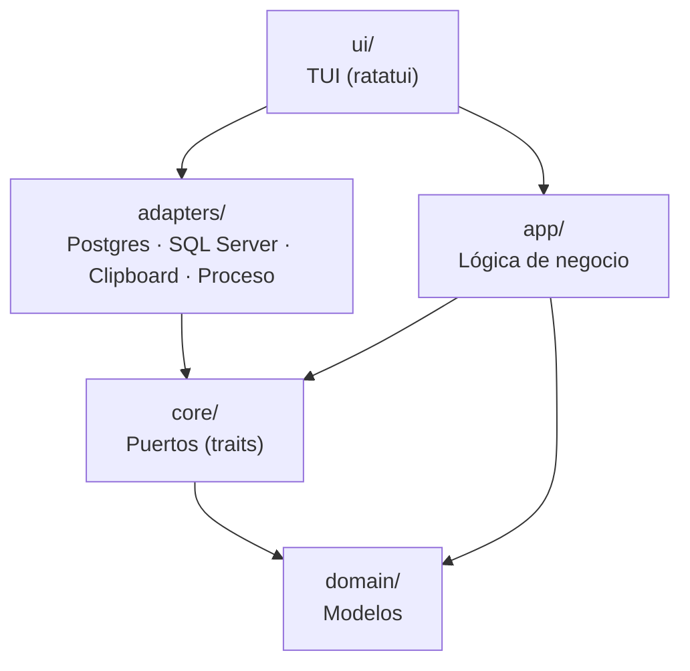
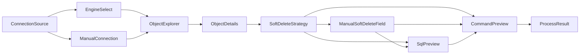

# Arquitectura del proyecto

## Visión general

`api-from-db-cli` está organizado en capas concéntricas donde las capas externas dependen de las internas, pero nunca al revés.



| Capa | Ruta | Responsabilidad |
|------|------|-----------------|
| Domain | `src/domain/` | Modelos de datos puros, sin lógica |
| Core | `src/core/` | Traits (puertos) y errores base |
| App | `src/app/` | Lógica de negocio reutilizable |
| Adapters | `src/adapters/` | Implementaciones concretas de infraestructura |
| UI | `src/ui/` | Interfaz de terminal, estado y flujo de pantallas |

## Capa Domain (`src/domain/`)

Define los tipos del sistema. No conoce ninguna otra capa.

Modelos principales:

- `ConnectionConfig` — datos de conexión a la base de datos
- `GeneratorConfig` — configuración del ejecutable externo (`cmd`, `flags`)
- `DatabaseObject` — tabla, función o stored procedure
- `TableSchema` — esquema completo de una tabla con sus columnas
- `ColumnSchema` — columna con tipo SQL original, tipo normalizado, nulabilidad, PK
- `NormalizedType` — enum de tipos normalizados (`Int`, `Str`, `Bool`, `Datetime`, `DeleteAt`, ...)
- `SoftDeleteConfig` — resultado de la resolución de soft delete
- `GeneratedCommand` — comando listo para ejecutar con argumentos separados
- `ProcessResult` — resultado de la ejecución externa (stdout, stderr, exit code)

## Capa Core (`src/core/`)

Define los contratos que los adapters deben cumplir.

```rust
trait ConnectionProvider  → test_connection(config) -> Result<(), AppError>
trait MetadataExplorer    → list_objects(config), get_table_schema(config, schema, table)
trait SqlExecutor         → execute_sql(config, sql)
trait ProcessRunner       → run(command) -> Result<ProcessResult, AppError>
trait Clipboard           → copy(value) -> Result<(), AppError>
```

Regla: esta capa solo define interfaces y el tipo `AppError`. No implementa nada.

## Capa App (`src/app/`)

Lógica de negocio pura y reutilizable. No conoce la UI ni los adapters concretos.

| Módulo | Responsabilidad |
|--------|-----------------|
| `TypeMapper` | Convierte tipos SQL del motor a `NormalizedType` |
| `SoftDeleteResolver` | Decide el `SoftDeleteConfig` según el esquema y la preferencia del usuario |
| `DdlBuilder` | Genera el SQL de `ALTER TABLE ... ADD COLUMN deleted_at` para cada motor |
| `CommandBuilder` | Construye el `GeneratedCommand` con campos y tipos normalizados |
| `GenerationService` | Orquesta TypeMapper + SoftDeleteResolver + DdlBuilder + CommandBuilder en un solo `preview_from_table()` |

`GenerationService` es el punto de entrada principal de esta capa. Recibe un `TableSchema` y devuelve un `GenerationPreview` con todo lo necesario para la UI.

## Capa Adapters (`src/adapters/`)

Implementaciones concretas de los traits del core.

| Archivo | Trait implementado |
|---------|-------------------|
| `postgres.rs` | `ConnectionProvider`, `MetadataExplorer`, `SqlExecutor` |
| `sqlserver.rs` | `ConnectionProvider`, `MetadataExplorer`, `SqlExecutor` |
| `process.rs` | `ProcessRunner` |
| `clipboard.rs` | `Clipboard` |
| `config.rs` | Carga y serialización de `ConnectionConfig` desde JSON |

**Punto de entrada:** `metadata_adapter_for(engine: DatabaseEngine) -> Box<dyn MetadataAdapter>`

La UI y los casos de uso siempre usan esta función. Nunca instancian `PostgresAdapter` o `SqlServerAdapter` directamente.

```rust
// Correcto
let adapter = metadata_adapter_for(engine);

// Incorrecto — no hacer esto desde la UI
let adapter = PostgresAdapter;
```

## Capa UI (`src/ui/`)

Interfaz de terminal construida con `ratatui` y `crossterm`. Organizada en subcapas:

```
ui/
├── tui.rs          ← coordinador: event loop, dispatch de teclas y render
├── state.rs        ← modelo de estado de toda la aplicación
├── screens/        ← render: transforma AppState en widgets ratatui
├── handlers/       ← input: interpreta teclas y actualiza estado
├── use_cases/      ← lógica de flujo: orquesta adapters y app layer
├── navigation.rs   ← helpers de navegación (mover índices, rotar selecciones)
└── mocks/          ← datos simulados para desarrollo
```

### Responsabilidades por subcapa

**`tui.rs`** — Solo coordina. Inicializa terminal, corre el event loop, delega teclas al handler correcto y render al screen correcto.

**`state.rs`** — Define `AppState` y todos los tipos de estado de pantalla (`Screen`, `ConnectionSource`, `SoftDeleteStrategy`, etc.). No conoce render ni terminal.

**`screens/`** — Solo dibujan. Reciben `&AppState` y devuelven widgets. No mutan estado, no ejecutan lógica.

**`handlers/`** — Solo reaccionan a teclas. Actualizan estado simple o llaman a un `use_case` y aplican su resultado al `AppState`.

**`use_cases/`** — Lógica real del flujo. Hablan con `adapters` y `app`. Devuelven outcomes tipados que los handlers aplican.

**`navigation.rs`** — Funciones puras para mover índices y rotar selecciones.

**`mocks/`** — Datos hardcodeados para desarrollo y pruebas visuales. No deben usarse en flujos reales.

### Pantallas del flujo



### Flujo de ejecución del event loop

```
TuiApp::run()
  └── event_loop()
        ├── draw()  →  screen correspondiente lee AppState y dibuja
        └── handle_key()
              ├── handler correspondiente interpreta la tecla
              ├── [opcional] llama use_case → obtiene outcome
              └── aplica outcome a AppState → draw() ve el nuevo estado
```

## Cómo agregar un nuevo motor de base de datos

1. Crear `src/adapters/nuevo_motor.rs` e implementar `ConnectionProvider`, `MetadataExplorer`, `SqlExecutor`.
2. Implementar `MetadataAdapter` para el nuevo tipo.
3. Agregar la variante en `domain::DatabaseEngine`.
4. Agregar el caso en `adapters::metadata_adapter_for()`.
5. Agregar el mapeo de tipos en `app::TypeMapper`.
6. Agregar la generación de DDL en `app::DdlBuilder`.
7. Exponer el motor en la pantalla `EngineSelect` de la UI.

## Cómo agregar una nueva pantalla TUI

Seguir este orden para que no quede código huérfano:

1. Agregar la variante en `state::Screen`.
2. Agregar el estado local de la pantalla en `state::AppState` si aplica.
3. Crear `screens/nueva_pantalla.rs` con la función de render.
4. Registrar el render en el `match` de `tui.rs::draw()`.
5. Crear `handlers/nueva_pantalla.rs` con la función de manejo de teclas.
6. Registrar el handler en el `match` de `tui.rs::handle_key()`.
7. Si hay lógica real, crear `use_cases/nueva_accion.rs` con su outcome tipado.
8. Llamar el use case desde el handler y aplicar su resultado al `AppState`.

## Principios aplicados

- **SRP**: render, manejo de eventos, lógica de flujo y datos simulados están en módulos separados.
- **DIP**: la UI depende de traits (`MetadataAdapter`), no de adapters concretos.
- **CQS**: use cases de consulta (como `soft_delete_inspection`) no mutan estado; use cases de resolución devuelven outcomes.
- **YAGNI**: no se introduce abstracción extra si el caso actual no la necesita.
